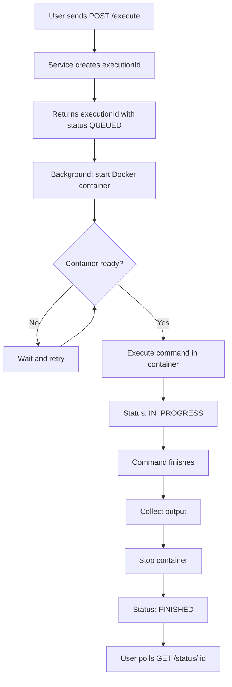

# Executor Service

A simple service to execute shell commands on a remote Docker executor, built with Kotlin and Ktor.

## Requirements

- Kotlin 2.2+
- Java 23
- Gradle 8.13
- Docker

## Build
```bash
./gradlew build
```

## Run
```bash
./gradlew run
```

## API

### Execute a command
```
POST /execute
{
  "command": "echo hello",
  "cpuCount": 1,
  "memoryMb": 512
}
```

### Get execution status
```
GET /status/{executionId}
```

## Flow


## TODO

### Setup
- [x] Project structure with Kotlin + Ktor + Gradle
- [ ] Docker integration

### API
- [ ] POST /execute endpoint
- [ ] GET /status/:id endpoint

### Execution
- [ ] Start Docker container
- [ ] Wait for container to be ready
- [ ] Execute command in container
- [ ] Collect output
- [ ] Update status
- [ ] Stop container

### Error handling
- [ ] Handle container start failure
- [ ] Handle command execution failure
- [ ] Handle timeout

### Tests
- [ ] Unit tests for ExecutionService
- [ ] Integration tests for API endpoints