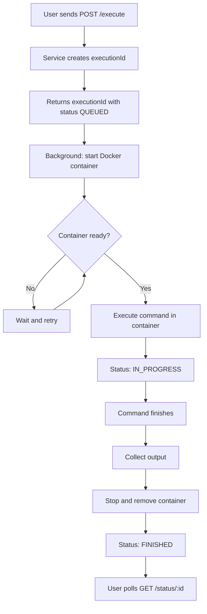

# Executor Service

A simple service to execute shell commands on a remote Docker executor, built with Kotlin and Ktor.

## Requirements

- Kotlin 2.2+
- Java 23
- Gradle 8.13
- Docker

## Build
```bash
./gradlew build
```

## Run
```bash
./gradlew run
```

## Run tests
```bash
./gradlew test
```

## API

### Execute a command
```
POST /execute
Content-Type: application/json

{
  "command": "echo hello",
  "cpuCount": 1,
  "memoryMb": 512
}
```

Response:
```json
{"executionId": "67e689ec-4617-47bd-b1e9-a8a0d6df5272"}
```

### Get execution status
```
GET /status/{executionId}
```

Response:
```json
{
  "executionId": "67e689ec-4617-47bd-b1e9-a8a0d6df5272",
  "status": "FINISHED",
  "output": "hello\n",
  "error": null
}
```

## Flow


## Design Decisions

**Docker as executor** — each command runs in an isolated Alpine container. This guarantees clean environments and easy resource limiting via Docker flags.

**ConcurrentHashMap for storage** — thread-safe in-memory store for execution state. Simple and sufficient for this use case.

**Coroutines for async execution** — the service returns the executionId immediately and runs the Docker lifecycle in the background using Kotlin coroutines.

**One container per execution** — each command gets its own container, started fresh and removed after completion. No shared state between executions.

## TODO

### Setup
- [x] Project structure with Kotlin + Ktor + Gradle
- [x] Docker integration

### API
- [x] POST /execute endpoint
- [x] GET /status/:id endpoint

### Execution
- [x] Start Docker container
- [x] Wait for container to be ready
- [x] Execute command in container
- [x] Collect output
- [x] Update status
- [x] Stop and remove container

### Error handling
- [x] Handle container start failure
- [x] Handle command execution failure
- [ ] Handle timeout

### Tests
- [x] Unit tests for ExecutionService
- [x] Integration tests for API endpoints
- [x] Docker executor tests